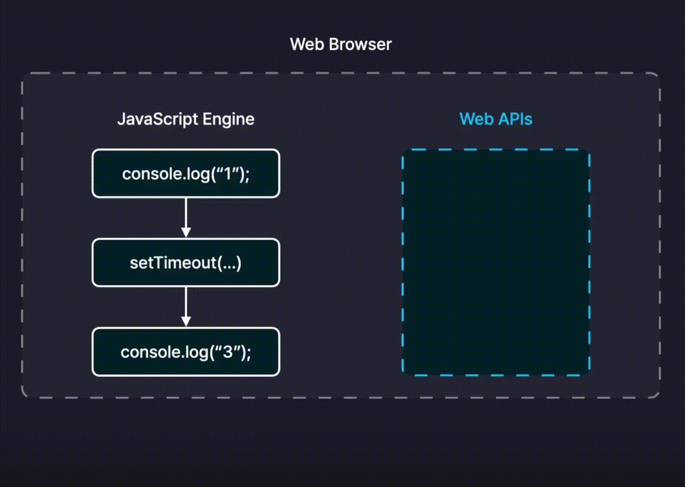

# Section02. JavaScript 심화

## 목차  
* [Truthy와 Falsy](#)
* [단락 평가](#)
* [구조분해할당](#)
* [Spread 연산자와 Rest 매개변수](#)
* [원시타입 VS 객체타입](#)
* [반복문으로 배열과 객체 순회하기](#)
* [배열 메서드](#)
* [Date 객체와 날짜](#)
* [동기와 비동기](#동기와-비동기)
* [비동기 작업 처리하기](#)


---

## 동기와 비동기
### 동기
#### JavaScript는 동기적으로 코드를 실행하는 Single Thread 언어
- 동기 : 여러개의 작업을 순서대로 하나씩 처리하는 방식
- Thread(쓰레드) : 작업을 직접 실행하고 처리해주는 역할. 타임라인
- Single Thread 언어이기 때문에 하나의 Thread, 하나의 stack이 존재.  
ㄴ 현재 task가 종료되기 전까지 다른 task가 실행될 수 없다는 것을 의미
- 장점 : 순차적으로 즉시 실행되어 순서를 보장할 수 있고, 프로그램의 실행 흐름을 파악하기 쉬움
- 단점 : 현재 task가 종료될때까지 다음 task가 실행되지 않는 *blocking이 발생, 전체 프로그램의 성능이 악화됨  
*blocking : task가 완료될 때까지 작업이 중단되고 이후 코드들이 실행되지 않음
```javascript
console.log(1);
console.log(3);

// 결과
1
3
// 순차적으로 실행되어 출력함
```

### 비동기
- 비동기 : 동기적이지 않음. 작업을 순서대로 처리하지 않음
- 비동기방식에서는 여러개의 작업이 주어졌을때, 앞선 작업이 종료되지 않아도 기다릴 필요 없이 다른 작업을 동시에 진행시키는게 가능

```javascript
console.log(1);
setTimeout(()=>{
  console.log(2);
});
console.log(3);

// 결과
1
3
2
// setTimeout() -> 비동기적으로 작동하는 내장함수로 특정 시간이 지난 이후에 비동기적으로 실행시켜주는 기능을 함
```
#### 🧐 Single Thread인 자바스크립트가 어떻게 동시에 작업을 할까?  

- 비동기 작업들은 자바스크립트 엔진에 있는 스레드가 실행하는게 아니라 Web APIs라는 브라우저가 직접 관리하는 별도의 공간에서 따로 실행되기 때문에 가능하다.
- Web APIs : 웹 브라우저가 직접 관리하는 별도의 영역으로 자바스크립트의 비동기 작업들이 실행되는 영역.
- 자바스크립트 엔진은 코드를 한 줄 씩 실행하다가 비동기 함수를 만나면 비동기 작업을 브라우저의 Web APIs에게 실행해달라고 부탁함 -> Web APIs는 타이머가 끝나면 실행할 콜백함수를 자바스크립트 엔진으로 넘겨줌.


<br>

## 비동기 작업 처리하기
### 1. 콜백함수
- 콜백함수를 이용해 비동기 함수작성해보기
```javascript
// 음식을 주문하는 상황
function orderFood(callback){
  setTimeout(() => {
    const food = "떡볶이";
    callback(food);
  }, 3000);
}

// 음식을 식히다
function cooldownFood(food, callback){
  setTimeout(() => {
    const cooldownedFood = `식은 ${food}`;
    callback(cooldownedFood);
  },2000);
}

// 냉동시키기
function freezeFood(food, callback){
  setTimeout(() => {
    const freezedFood = `냉동된 ${food}`;
    callback(freezedFood);
  },1500);
}

orderFood((food) => {
  console.log(food);

  cooldownFood(food,(cooldownedFood) => {
    console.log(cooldownedFood);
    
    freezeFood(cooldownedFood, (freezedFood) => {
      console.log(freezedFood);
    });
  });
});
```
- 비동기 작업의 결과를 콜백 함수로 처리하고 비동기 작업의 결과를 또 다른 비동기 작업의 인수로 활용 가능하다
- 하지만 이 방법으로 기능이 많아지면 인덴트(indent, 들여쓰기)가 깊어지고 가독성이 안 좋아지는 이런 걸 `콜백 지옥`현상 발생
- 콜백 지옥(callback hell)👾 : 콜백 함수가 중첩되어 코드의 깊이가 깊어지는 이상한 현상

### 2. Promise
#### Promise 란?
- 비동기 작업을 효율적으로 처리할 수 있도록 도와주는 자바스크립트의 내장 객체
- Promise는 비동기 작업들을 감싸는 객체
- API 호출 및 다른 서버와 통신할때 Promise 객체가 사용됨

#### Promise의 효능
- 비동기 작업 실행 
- 비동기 작업 상태 관리
- 비동기 작업 결과 저장
- 비동기 작업 병렬로 동시 실행
- 비동기 작업 다시 실행

#### Promise는 진행 단계에 따라 3가지의 상태로 나눠서 관리

1. **대기(Pending)**  
- 비동기 작업이 진행중인, 아직 작업이 완료되지 않은 상태 `ex) 영상 로딩중`

2. **성공 (Fulfilled)**  
- 비동기 작업이 성공적으로 마무리 된 상태 `ex) 영상 시청 가능`
- 해결(Resolve) : 대기 -> 성공. `ex) 영상 시청 가능한 상태`

3. **실패 (Rejected)**
- 비동기 작업이 실패(ex. 네트워크 오류, 코드 오류)한 상태 `ex) 영상 시청 불가능한 상태`
- 거부(reject) : 대기 -> 실패. `ex) 영상 로딩 실패`

#### Promise 객체 만들기
- Executor function : 비동기 작업을 실행하는 함수, 익섹큐터 함수라고 읽음!
```javascript
const promise = new Promise(() => {
  setTimeout(() => {
    console.log("안녕");
  },2000);
});
// 결과 : 안녕
```
- 위 코드를 `console`에 출력하면, Promise상태는 pending 대기, Result는 undefined
```javascript
Promise {<pending>}
> [[Prototype]]: Promise
  [[PromiseState]]: "pending"
  [[PromiseResult]]: undefined
```
- Executor함수에는 두가지의 매개변수가 존재  
  - resolve : 비동기 작업을 성공 상태로 바꾸는 함수
  - reject : 비동기 작업을 실패 상태로 바꾸는 함수

- resolve상태로 바꾸기
```javascript
const promise = new Promise((resolve, reject) => {
  setTimeout(() => {
    console.log("안녕");
    resolve("성공");
    reject("왜 실패했는가..");
  },2000);
});
setTimeout(() => {
  console.log(promise);
});

// 결과
안녕 
Promise {<pending>}
> [[Prototype]]: Promise
  [[PromiseState]]: "fulfilled"
  [[PromiseResult]]: "성공"
```
- reject 상태로 바꾸기
```javascript
const promise = new Promise((resolve, reject) => {
  setTimeout(() => {
    console.log("안녕");
    reject("왜 실패했는가..");
  },2000);
});
setTimeout(() => {
  console.log(promise);
});
// 결과
안녕 
Promise {<pending>}
> [[Prototype]]: Promise
  [[PromiseState]]: "rejected"
  [[PromiseResult]]: "왜 실패했는가.."
```

#### then()과 catch()
##### then()
- Promise객체의 메서드로 "그 후에"라는 뜻을 갖음
- Promise를 리턴하고 두 개의 콜백 함수를 인수로 받음
  - Promise가 **1) 성공**했을때, **2) 거부**했을때
```javascript
// then 메서드 -> resolve를 가져옴
promise.then((value) => {
  console.log(value);
})
```

##### catch()
- Promise가 **거부**될 때 호출할 함수를 예약
```javascript
// catch 메서드 -> reject를 가져옴
promise.catch((error) => {
  console.log(error);
})
```

##### Promise Chaining
```javascript
promise.then((value) => {
  console.log(value);
}).catch((error) => {
  console.log(error);
})
```
함수안에 Promise 객체를 새롭게 생성하고 동적으로 매개변수를 받아서 사용해보자!

```javascript
function add10(num){
  const promise = new Promise((resolve, reject) => {
    setTimeout(() => {
      const num = null;
  
      if(typeof num === "number"){
        resolve(num + 10);
      }else{
        reject("num의 숫자가 아닙니다");
      }
    },2000);
  });

  return promise;
}

const p = add10(0);
p.then((result) => {
  console.log(result);

  const newP = add10(result);
  newP.then((result) => {
    console.log(result);
  })
});
```
콜백지옥을 벗어나보자
```javascript
const p = add10(0);
p.then((result) => {
  console.log(result);

  const newP = add10(result);
  return newP;
}).then((result) => {
  console.log(result);
});
```
한 번 더 간결하게!
```javascript
add10(0).then((result) => {
  console.log(result);
  return add10(result);
}).then((result) => {
  console.log(result);
}).then((result) => {
  console.log(result);
}).catch((error) => {
  console.log(error);
});
```

#### 프로미스 객체를 함수로 만드는 이유
1. 재사용성  
: 프로미스 객체를 함수로 만들면 필요할 때마다 호출하여 사용함으로써, 반복되는 비동기 작업을 효율적으로 처리 할 수 있다.
2. 가독성  
: 프로미스 객체를 함수로 만들면 코드의 구조가 명확해져, 비동기 작업의 정의와 사용을 분리하여 코드의 가독성을 높힐 수 있다.
3. 확장성  
: 프로미스 객체를 함수로 만들면 인자를 전달하여 동적으로 비동기 작업을 수행할 수 있다. 또한 여러 개의 프로미스 객체를 반환하는 함수들을 연결하여 복잡한 비동기 로직을 구현 할 수 있다.

### 3. Async & Await
- promise를 좀 더 직관적이고 편하게 사용할 수 있도록 도와주는 기능

#### async
- 함수 앞에 붙이는 키워드로 비동기 함수로 만들어주는 키워드
- 함수가 프로미스를 반환하도록 변환해주는 키워드
- promise를 반환하지 않는 함수에 붙혀서 자동으로 해당 함수를 비동기로 작동하도록 변환하는 기능

```javascript
async function getData(){
  return new Promise((resolve, reject) => {
    setTimeout(() => {
      resolve({
        name: "백수진",
        id: "suzinb",
      });
    }, 1500);
  })
}

console.log(getData());
```
#### await
- async 함수 내부에서만 사용이 가능한 키워드
- 비동기 함수가 다 처리되기를 기다리는 역할
```javascript
function printData(){
  getData().then((result) => {
    console.log(result);
  });
}

printData();
```
- async와 await를 이용하면 then 메서드를 복잡하게 쓸 필요가 없음!
- getData함수가 반환하는 promise의 비동기 작업이 종료되기까지 기다렸다가 종료가 되면 결과 값을 가져옴 
- 비동기 작업을 동기작업하듯 간결하게 사용 가능
- await은 async가 붙지 않은 함수에서 사용하면 오류 발생
```javascript
async function printData(){
  const data = await getData(); 
  console.log(data);
}

printData();
```
