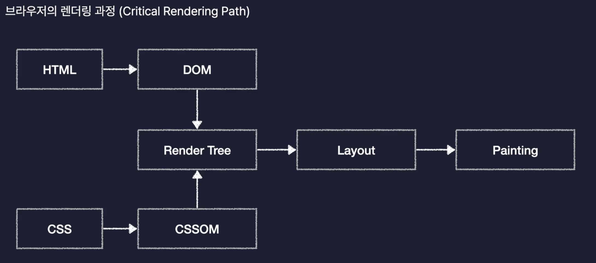
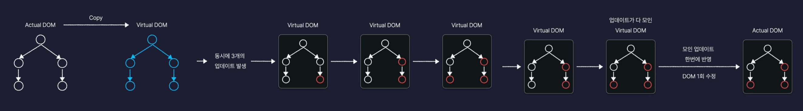

# Section04. React.js 개론

## 목차  
* [React.js를 소개합니다](#reactjs를-소개합니다)
* [첫 React App 생성하기](#첫-react-app-생성하기)
* [React App 구동원리 살펴보기](#react-app-구동원리-살펴보기)

---

## React.js를 소개합니다
### React.js란?
- Meta(Facebook)이 개발한 오픈소스 JavaScript 라이브러리
- 복잡한 대규모 웹 서비스의 UI를 더 편하고 빠르게 개발할 수 있도록 만들어진 기술
- React.js로 만들어진 서비스들 : 넷플릭스, 페이스북, 인스타그램, 노션

### React의 기술적인 특징
1. 컴포넌트를 기반으로 UI를 표한한다
2. 화면 업데이트 구현이 쉽다
3. 화면 업데이트가 빠르게 처리된다

✅ 완강 후 다시듣기 추천

### React의 기술적인 특징 1. 컴포넌트를 기반으로 UI를 표현한다.
- 컴포넌트(Component) : 구성요소. 화면을 구성하는 요소, UI를 구성하는 요소
- 공통적인 파일을 component 단위로 나눠서 모듈화해 보관할 수 있음
- 장점
  1. 중복 코드 제거
  2. 해당 파일만 수정하면 되기 때문에 유지보수 용이

### React의 기술적인 특징 2. 화면 업데이트 구현이 쉽다
- 업데이트 : 사용자의 행동(클릭, 드래그)에 따라 웹 페이지가 스스로 모습을 바꿔 상호작용 하는 것
- React.js에서는 **선언형 프로그래밍** 방식으로 동작
- 선언형 프로그래밍
  - 불필요한 과정을 생략하고 내가 이루고자 하는 **목적**만 간결히 명시하는 방법
  - 목적한 깔끔하게 명시하기 때문에 코드가 간결함
- 명령형 프로그래밍
  - 선언형 프로그램의 반대
  - 목적을 이루기 위한 모든 일련의 **과정**을 설명하는 방식
  - 모든 과정을 하나하나 다 설명하기 때문에 코드가 길고 복잡함
- React.js는 선언형 프로그래밍 방식으로 동작하기 때문에 간단하게 화면을 업데이트가 할 수 있다.
- 원리
  - React.js에서는 페이지를 컴포넌트 단위로 나눠서 개발
  - 각 컴포넌트에는 State 변수(컴포넌트의 상태를 저장)를 저장할 수 있음
  - State값에 따라 다른 UI를 화면에 렌더링하도록 설정
  - 렌더링 : 웹페이지 화면에 UI요소를 그려내는 것
- 정리 : 업데이트를 위한 복잡한 동작을 직접 정의할 필요 없이 특정 변수의 값을 바꾸는 것 만으로도 화면을 업데이트 시킬 수 있다.

### React의 기술적인 특징 3. 화면 업데이트가 빠르게 처리된다
- 어떻게 가능할까?🤔
  - 브라우저는 어떻게 동작하는가?
  - HTML, CSS로 만든 페이지를 어떻게 렌더링 하는가?
  - 화면 업데이트는 어떻게 처리 되는가?
- 브라우저의 렌더링 과정 (Critical Rendering Path) :  

(1) HTML은 DOM(Document Object Model), CSS는 CSSOM(Object Model)로 변환 - 브라우저가 자기가 더 이해하기 쉬운 방식으로 변환한 형태의 객체  
(2) DOM, CSSOM을 합쳐서 Render Tree를 만듦  
Render Tree : 웹페이지의 청사진,설계도. 화면에 렌더링 되어야하는 요소들의 모든 정보를 포함.  
(3) Layout : 요소의 배치를 잡는 작업  
(4) Painting : 실제로 화면에 그려내는 과정

- 화면의 업데이트는 JavaScript가 DOM을 수정하면 발생
- Layout 과 Painting은 오래 걸림 -> 성능 악화됨
  - Reflow: Layout을 다시 한다.
  - Repaint: Painting을 다시 한다.
- 동시에 발생한 업데이트를 모아서 한번에 수정해 DOM 수정 횟수를 최소화해야함
- React는 이 과정을 자동으로 해줌(Feat. Virtual DOM)
- Virtual DOM 이란?
  - DOM을 자바스크립트 객체로 흉내낸 것으로 일종의 복제판이라고 생각하면 된다.
  - React는 업데이트가 발생하면 실제 DOM을 수정하기 전에 가상의 복제판 DOM에 먼저 반영해준다.



<br>

## 첫 React App 생성하기
- React App, React Application : 어플리케이션에 가까울 정도로 다양한 기능을 제공

### 생성 과정
1. Node.js 패키지 생성
2. React 라이브러리 설치
3. 기타 도구 설치 및 설정
- Vite(빝) : 차세대 프론트엔드 개발 툴. 기본 설정이 적용된 React App 생성 가능

### 생성 및 설치하기
1. 터미널에 `npm create vite@latest` 입력
   1. Project name : section04
   2. Select a framework : React
   3. Select a variant : JavaScript
2. 설치 후 폴더를 새로 열어 세팅
3. package.json  
  3.1 dependencies의 react-dom이 18버전 아랫버전이면 잘못 설치됨  
  3.2 devDependencies : 오직 개발할때만 사용되는 라이브러리들
4. `npm i`입력해 package.json의 라이브러리 설치

### 생성된 폴더와 파일
`/public/`  
- image, font 같은 정적인 파일을 저장하는 폴더  

`/src/`  
- source의 약자로 react나 javascript 코드를 보관
- .jsx 확장자를 리액트에서 사용되는 확장자
- /assets/ -> public 폴더처럼 정적 파일 보관할 수 있음!

`.eslintrc.cjs`  
- eslint라는 도구의 설정 파일
- eslint 도구 : 개발자들 사이에 코드 스타일을 통일하는 데에 도움을 주는 도구 

`.gitignore`  
- React App을 github 같은 곳에 업로드 할 때 올리면 안되는 파일들을 명시하는 곳

`index.html`  
- React App의 기본 틀 역할을 하는 HTML 코드가 담긴 파일

`vite.config.js`  
- vite 도구의 옵션을 설정하는 파일

### React App 실행
- package.json의 scripts에 4가지 명령어가 설정되어 있음
- `dev` : React App을 개발용으로 실행
- 생성된 Local 주소를 웹 브라우저에 띄울 수 있음
- Shortcut : 
  - r + enter : 서버를 다시 시작
  - u + enter : 서버의 주소를 다시 보여줌
  - o + enter : 브라우저에 이 주소로 접근
  - c + enter : 콘솔 celar
  - q + enter : 종료
<br>

## React App 구동원리 살펴보기

### 리액트 앱에서 어떻게 접속할까?
- Vite를 통해 생성한 리액트 앱에는 웹서버가 내장되어 있음
- 그리고 npm run dev 명령어를 통해 리액트 서버를 가동 시킴
- 이때 나온 로컬 주소(http://localhost:5173)에서 localhost는 '내 컴퓨터', 5173은 포트 번호
- 포트 번호(Port Number) :하나의 컴퓨터 내에서 여러 대의 서버를 동작시키기 위해 필요한 주소 체계
- 브라우저에서 내 컴퓨너에 실행되고 있는 리액트 웹서버에 접속 요청을 보낸다

### 어떤 원리를 통해 화면에 렌더링할까?
- 터미널에서 npm run dev로 리액트 웹 서버를 가동시켜주면 리액트 앱은 index.html이라는 파일을 브라우저에 보냄
- script로 불러온 `main.jsx` 파일을 보자
```javascript
import { StrictMode } from 'react'
import { createRoot } from 'react-dom/client'
import './index.css'
import App from './App.jsx'

createRoot(document.getElementById('root')).render(
  <StrictMode>
    <App />
  </StrictMode>,
)
```
- ReactDOM의 createRoot라는 메서드는 인수로 전달받은 HTML 요소를 리액트의 Root(뿌리)로 만들어주는 역할을 한다.
- render 메서드를 호출해 이 Root아래에 `<App />`를 렌더링 하겠다고 설정하고 있음
  - `<App />` 문법은 컴포넌트를 렌더링 하는 문법임
- 그렇다면 `<App />` 컴포넌트는 어디서 왔을까?
- ES 모듈 시스템 문법으로 App이라는 것을 `app.jsx`로 import하고 있음
- `app.jsx`에는 App() 함수가 html 태그들을 return하고 있음
  - React에서는 HTML 태그들을 리턴하는 함수를 컴포넌트라고 부름.

<br>